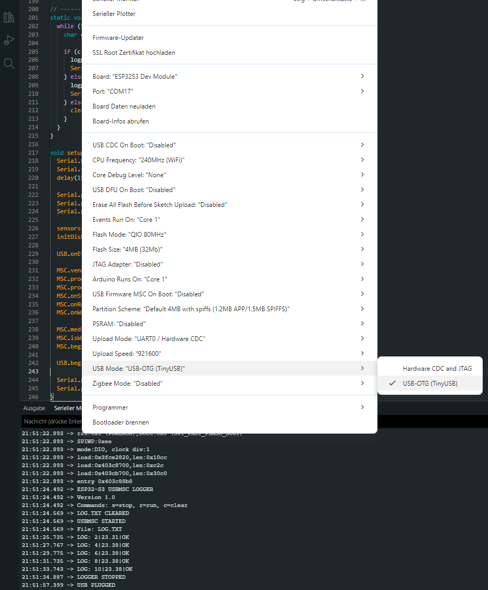
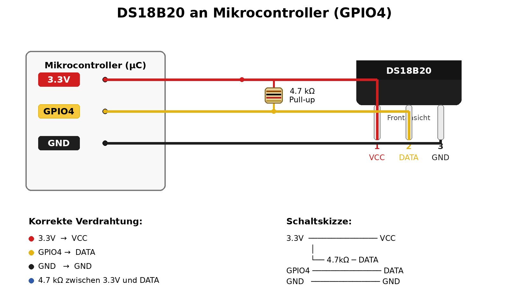
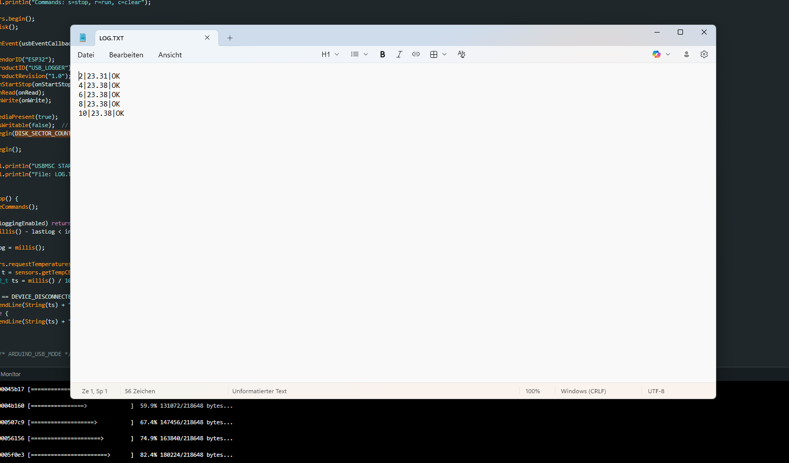
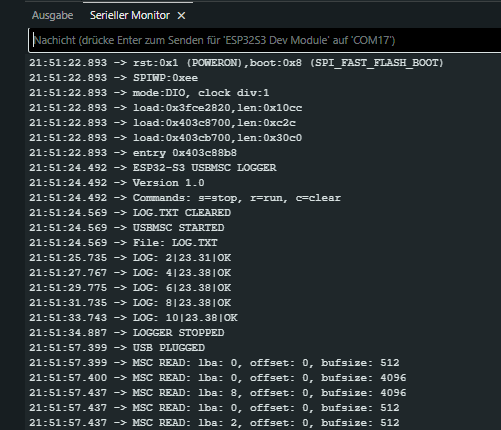

# ESP32-S3 USBMSC Logger mit DS18B20

Ein einfacher USB-Mass-Storage-Datenlogger auf Basis eines **ESP32-S3**.  
Das Board meldet sich am PC als **USB-Laufwerk** und schreibt Messwerte eines **DS18B20** in eine Datei `LOG.TXT`.

## Features

- **ESP32-S3** mit nativer USB-Schnittstelle
- **USBMSC** (USB Mass Storage Class)
- **DS18B20** Temperatursensor
- Ausgabe in `LOG.TXT`
- Trennzeichen: `|`
- Steuerung per Serial Monitor
- Logging in festen Intervallen

---

## Benötigte Hardware

- ESP32-S3 Board
- DS18B20
- 4.7 kΩ Pull-up-Widerstand
- USB-Datenkabel

---

## Benötigte Libraries

Diese Bibliotheken müssen in der Arduino IDE installiert sein:

- `OneWire`
- `DallasTemperature`
-  `http://arduino.esp8266.com/stable/package_esp8266com_index.json`
-  
Zusätzlich wird der im ESP32-Core enthaltene USB-Support verwendet:

- `USB.h`
- `USBMSC.h`

Diese beiden gehören zum **ESP32 Arduino Core** und müssen normalerweise **nicht separat installiert** werden.

---

## Arduino IDE Einstellungen

Empfohlene Einstellungen:

Wichtig:
- Das Projekt funktioniert nur mit einem **ESP32-S3** oder einem anderen ESP32 mit **nativer USB-Schnittstelle**.
- Ein normales ESP32-WROOM-Board ohne native USB-Schnittstelle ist **nicht geeignet**.

---

## Anschluss des DS18B20

## Log File

## Serial Monitor

## Codebasis

Dieses Projekt basiert auf dem offiziellen **ESP32 USB Mass Storage Beispiel (USBMSC)** aus dem Arduino-ESP32 Core.

Das ursprüngliche Beispiel zeigt, wie ein ESP32-S3 als **USB-Massenspeichergerät** (USB MSC) am Computer erscheint.

Originalquelle:

https://github.com/espressif/arduino-esp32/tree/master/libraries/USB/examples/USBMSC
